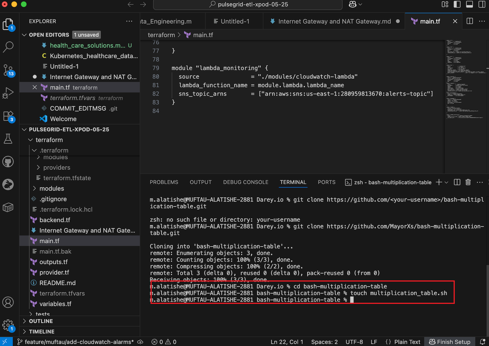
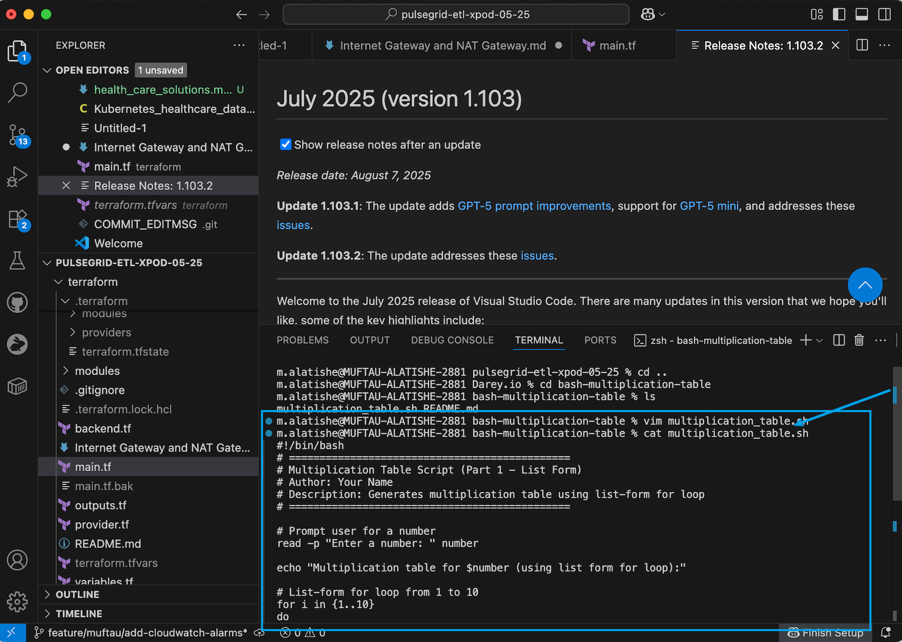
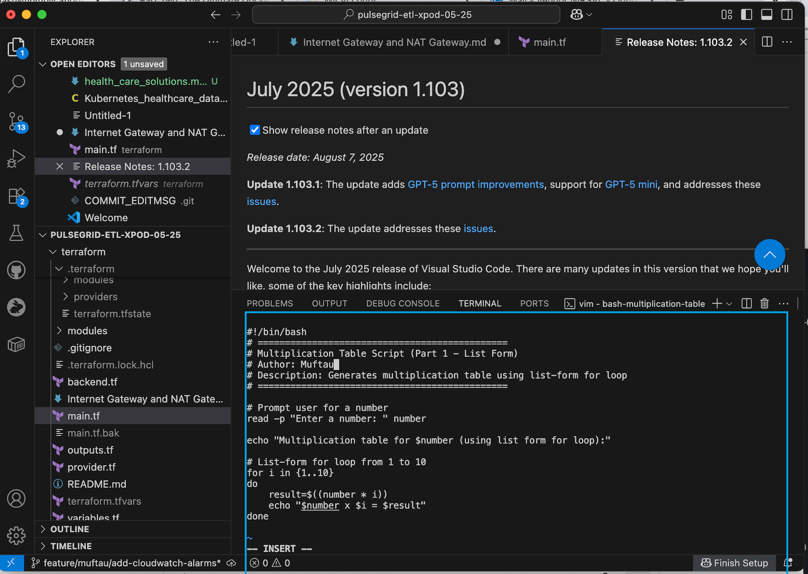
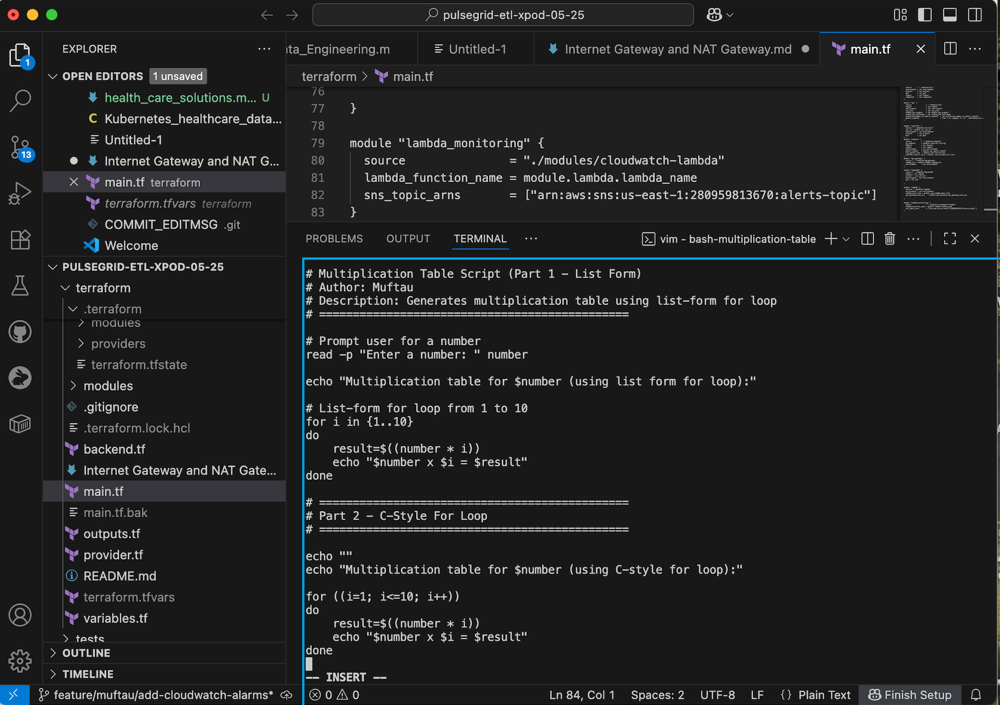
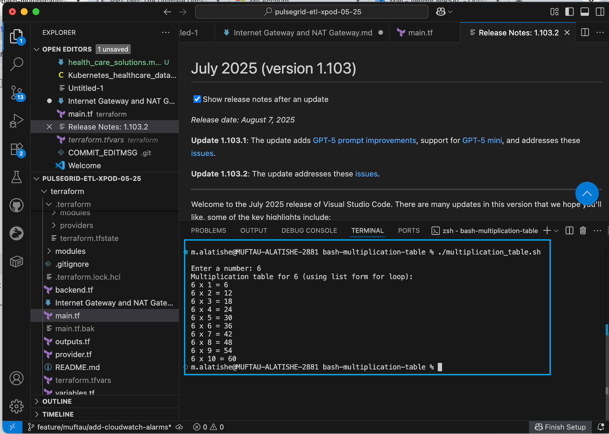
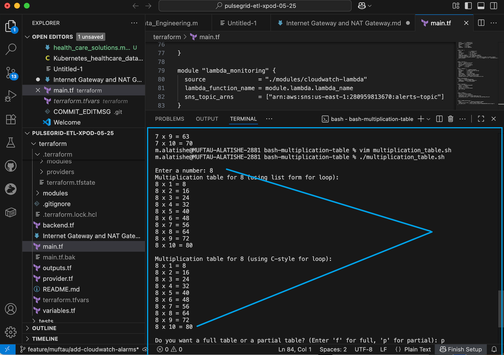
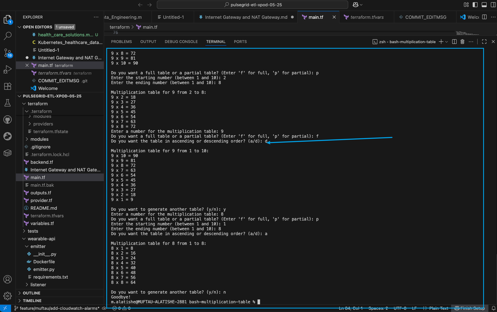
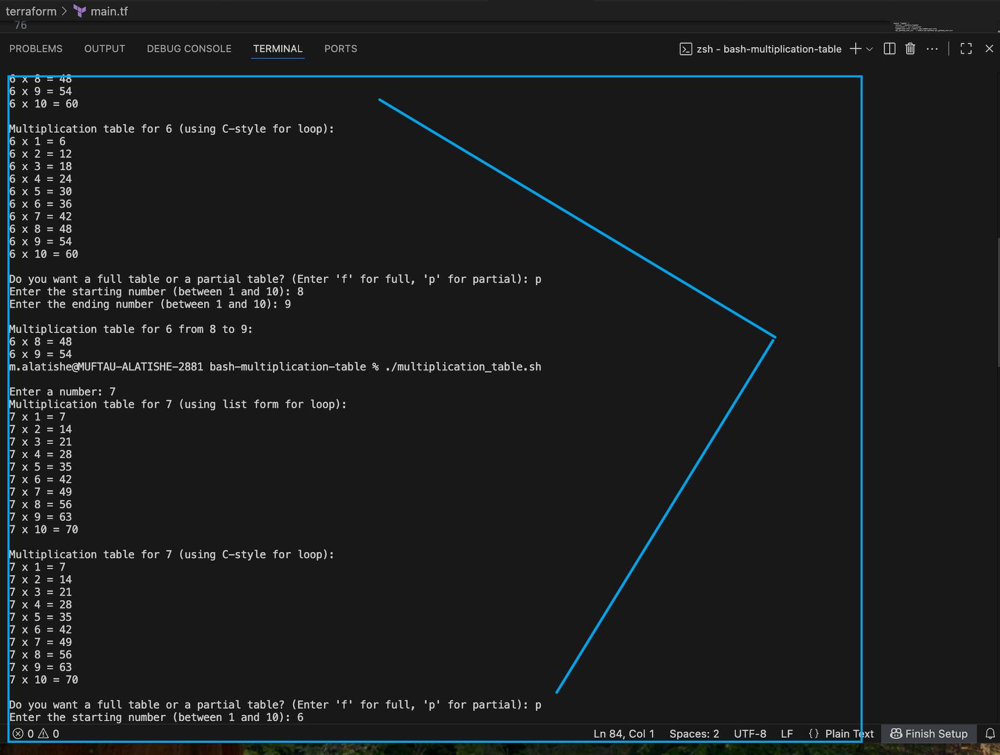
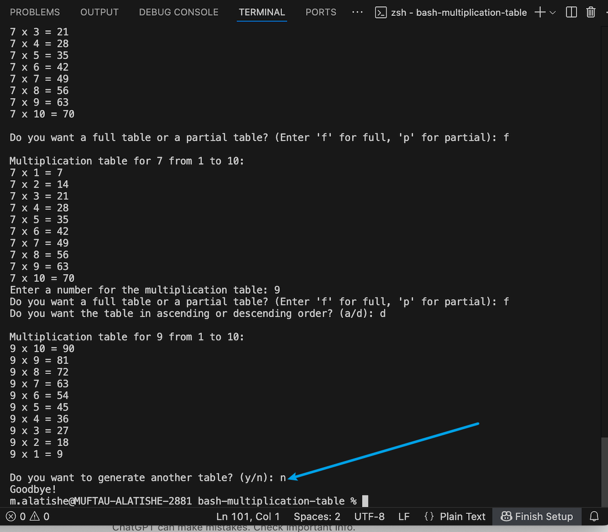

# bash-multiplication-table
Capstone project: Bash script that generates multiplication tables (full/partial) using loops and conditional logic.

# Bash Multiplication Table Script

## 📌 Project Summary
This project implements a **Bash script** that generates multiplication tables using both **list form** and **C-style for loops**. It enhances user interaction by allowing full or partial tables, ascending/descending order, and repeating until exit.  

The assignment demonstrates **looping, input handling, and script interactivity in Bash**.

---

## 🎯 Learning Objectives
- Understand how to use variables to store user inputs and use them in calculations.
- Learn the syntax and use cases of both list form and C-style for loops.
- Practice using loops to automate repetitive tasks, such as generating a multiplication table.
- Enhance the script's interactivity and user-friendliness by incorporating user input and clear output formatting.

---

## 📂 Repository Structure

bash-multiplication-table/
│── multiplication_table.sh # Main Bash script
│── README.md # Project documentation
└── screenshots/ # Screenshots of outputs


📸 **Screenshot: Project Repo Structure**  


---

## ⚙️ Implementation Steps

### 1️⃣ Create the Script File
We created `multiplication_table.sh` to hold the Bash script.

📸 **Screenshot: Create Script File**  


---

### 2️⃣ Edit the Script
We edited the script to add **list form for loop** and **C-style for loop**.

📸 **Screenshot: Editing Script**  


---

### 3️⃣ Run Full Table Output
The script first runs a **full multiplication table (1–10)**.

�� **Screenshot: Full Execution**  


---

### 4️⃣ C-Style For Loop Output
The second part demonstrates the **C-style loop** implementation.

📸 **Screenshot: C-Style Loop Output**  


---

### 5️⃣ Partial Table Execution
User can choose **partial tables** by specifying start and end values.

📸 **Screenshot: Partial Table Output**  


---

### 6️⃣ Invalid Input Handling
Invalid ranges (e.g., start > end) are caught, and the script defaults to full table.

📸 **Screenshot: Invalid Input Handling**  


---

### 7️⃣ Bonus Features

- **Ascending/Descending Order**  
📸 **Screenshot: Descending Order Execution**  


- **Repeat Until Exit**  
�� **Screenshot: Script Repeat & Exit**  


---

## ✅ Final Testing
The script was tested with multiple numbers and input variations to confirm correctness.  

📸 **Screenshot: Final Task Exit**  


---

## 🚀 How to Run

## 🖥️ Usage Instructions
1. Clone the repository:
   ```bash
   git clone https://github.com/MayorXs/bash-multiplication-table.git
   cd bash-multiplication-table

